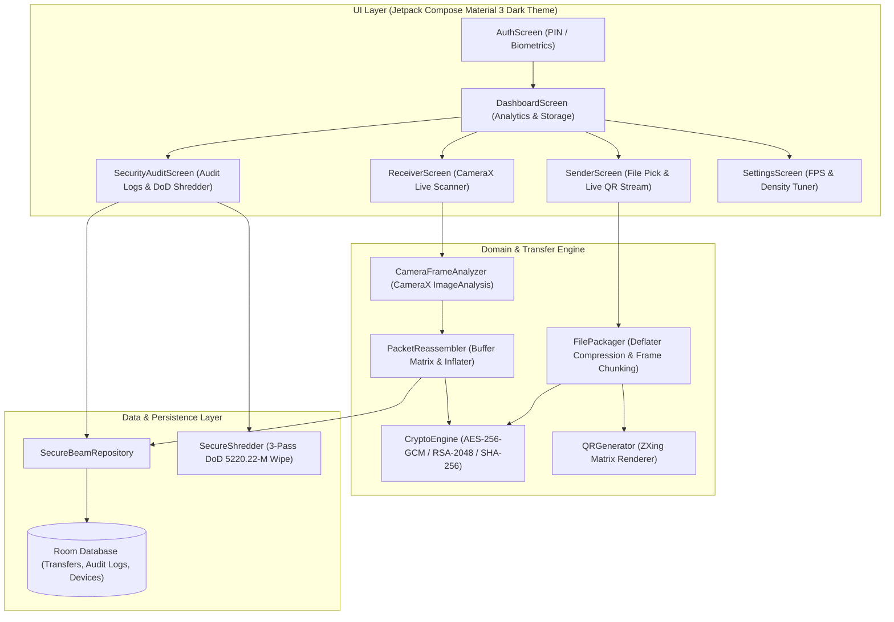
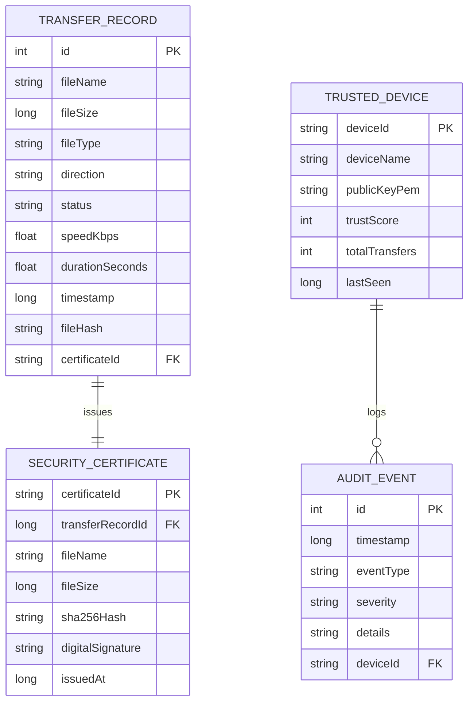
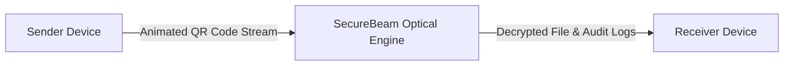
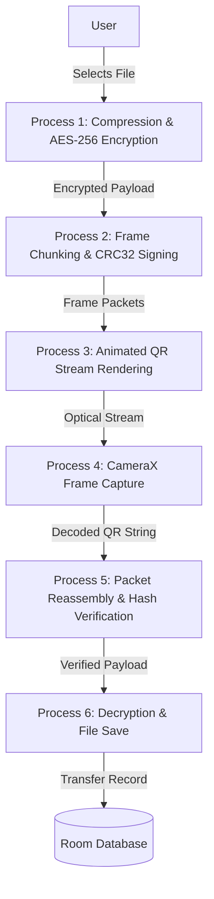
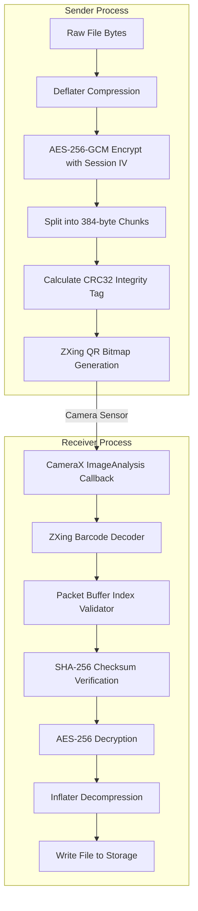
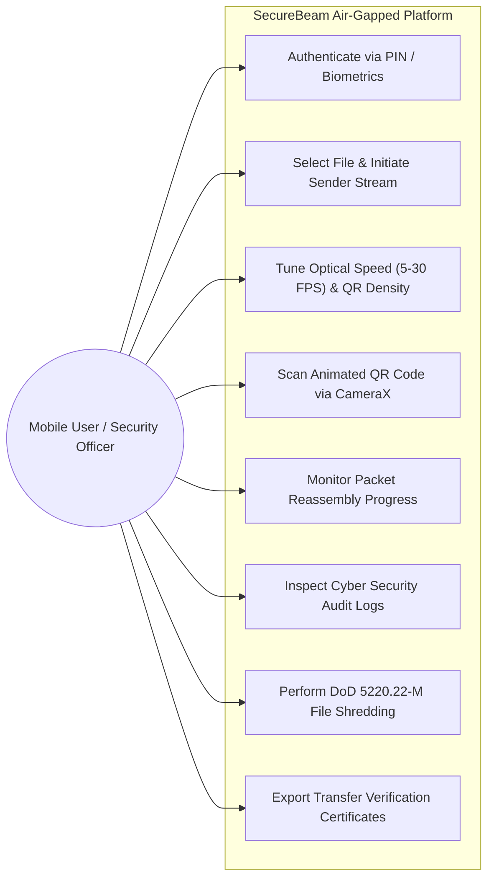
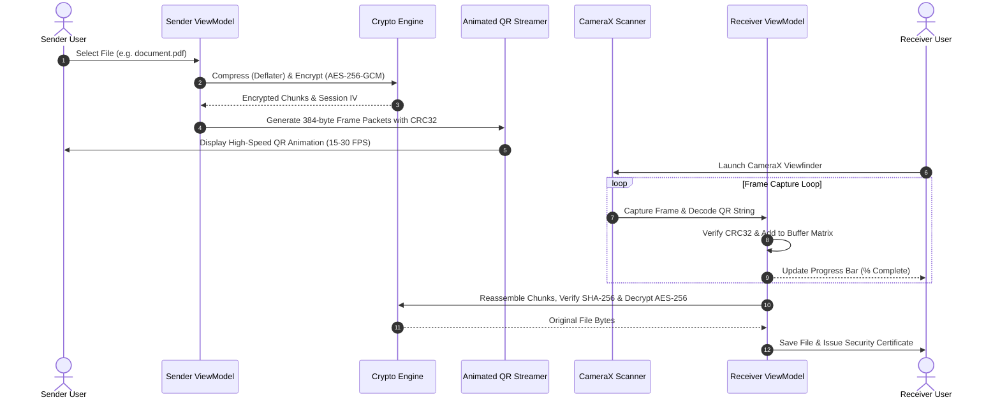
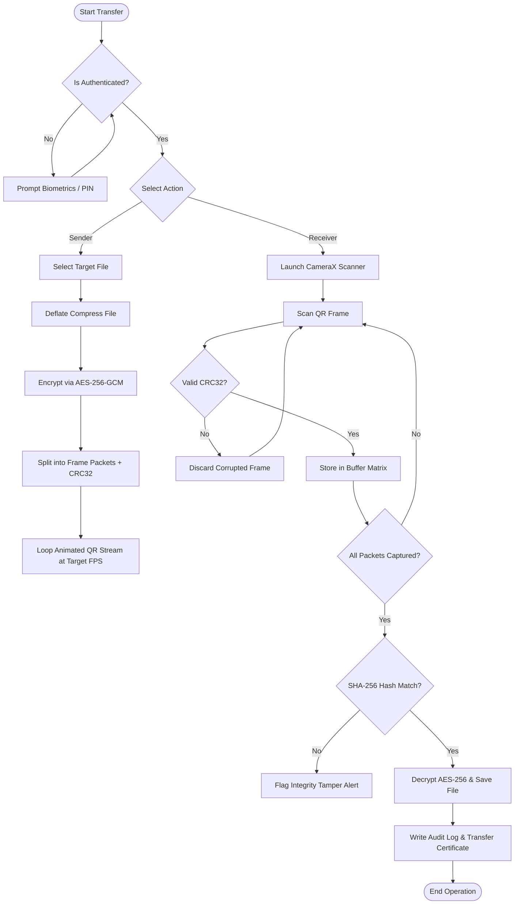

# SecureBeam - Technical Documentation & System Specifications

**SecureBeam** is a zero-trust, air-gapped Android application designed for ultra-secure offline data exchange between devices. It completely eliminates network dependencies (Wi-Fi, Bluetooth, NFC, Mobile Data, Internet) by converting encrypted binary files into high-speed animated QR code streams scanned via CameraX.

---

## 1. System Architecture & UML Overview

### 1.1 High-Level Architecture Diagram

---

## 2. Entity-Relationship (ER) Diagram

---

## 3. Data Flow Diagrams (DFD)

### 3.1 DFD Level 0 (Context Diagram)

### 3.2 DFD Level 1 (Process Breakdown)

### 3.3 DFD Level 2 (Detailed Optical Transfer Process)

---

## 4. Use Case Diagram

---

## 5. Sequence Diagram

### 5.1 Sender & Receiver Sequence Flow

---

## 6. Activity Diagram

---

## 7. Optical Frame Protocol Specification

### Packet Payload Structure
Each frame is encoded as a pipe-separated string with prefix `SECBEAM`:
`SECBEAM|SessionID|PacketIndex|TotalPackets|FileName|FileSize|FileHash|IV|Key|PayloadChunk|CRC32`

| Field | Type | Description |
| :--- | :--- | :--- |
| `Header` | String | Fixed identifier (`SECBEAM`) |
| `SessionID` | String | 8-character random session UUID |
| `PacketIndex` | Integer | 1-based index of current frame |
| `TotalPackets` | Integer | Total number of frames in transmission |
| `FileName` | String | Original file name |
| `FileSize` | Long | Size of original file in bytes |
| `FileHash` | String | SHA-256 hash of original file |
| `IV` | String | Base64-encoded 12-byte AES-GCM IV |
| `Key` | String | Base64-encoded 256-bit AES Session Key |
| `PayloadChunk` | String | Base64-encoded encrypted chunk payload |
| `CRC32` | Long | CRC-32 checksum of previous fields |

---

## 8. Database Schema Specifications

### `transfer_records` Table
| Column Name | Data Type | Constraint | Description |
| :--- | :--- | :--- | :--- |
| `id` | INTEGER | Primary Key, Auto-increment | Unique record ID |
| `fileName` | TEXT | NOT NULL | File name transferred |
| `fileSize` | INTEGER | NOT NULL | Size in bytes |
| `fileType` | TEXT | NOT NULL | File extension category |
| `direction` | TEXT | NOT NULL | `SENDER` or `RECEIVER` |
| `status` | TEXT | NOT NULL | `COMPLETED`, `FAILED`, `INTERRUPTED` |
| `speedKbps` | REAL | NOT NULL | Speed in Kilobits/sec |
| `durationSeconds`| REAL | NOT NULL | Transfer elapsed time |
| `timestamp` | INTEGER | NOT NULL | Unix timestamp |
| `fileHash` | TEXT | NOT NULL | SHA-256 hash digest |
| `certificateId` | TEXT | NOT NULL | Unique transfer certificate ID |

---

## 9. Future Scope & Enhancement Roadmap

1. **Optical Reed-Solomon Error Correction**: Adding forward error correction (FEC) parity frames to recover missing QR packets without retransmission.
2. **Multi-Device Broadcast Transfer**: Streaming high-speed optical QR codes to multiple receiving devices simultaneously.
3. **PC Companion App**: Windows / Linux / macOS companion app for cross-platform air-gapped transfers.
4. **Hardware Key Integration**: YubiKey / HSM support for hardware-backed RSA digital signatures.
